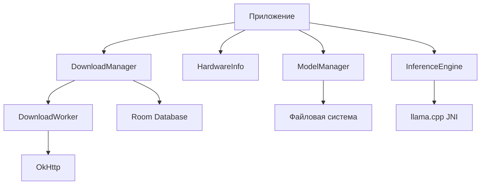

# Архитектура библиотеки Sugar Pocket AI

## Обзор

Библиотека предоставляет функционал для работы с AI моделями: скачивание, управление, информация об аппаратном обеспечении, запуск инференса. Переписана на Java на основе кода из проекта PocketPal AI (Kotlin/React Native).

## Компоненты

### 1. Менеджер загрузок (Download Manager)

**Цель**: Управление загрузкой файлов (моделей) с поддержкой паузы, возобновления, отмены, прогресса.

**Классы**:

- `DownloadEntity` – сущность базы данных (id, url, destination, totalBytes, downloadedBytes, status, priority, networkType, createdAt, error, authToken).
- `DownloadStatus` – enum (QUEUED, RUNNING, PAUSED, COMPLETED, FAILED, CANCELLED).
- `NetworkType` – enum (ANY, WIFI).
- `DownloadDao` – интерфейс DAO для операций с базой.
- `DownloadDatabase` – база данных Room (синглтон).
- `DownloadWorker` – фоновый Worker (WorkManager) для выполнения HTTP-загрузки с использованием OkHttp.
- `DownloadManager` – основной класс, предоставляющий API для управления загрузками (старт, пауза, возобновление, отмена, получение списка).
- `ProgressResponseBody` – кастомный ResponseBody для отслеживания прогресса.

**Зависимости**:

- Room (androidx.room:room-runtime, androidx.room:room-compiler)
- WorkManager (androidx.work:work-runtime)
- OkHttp (com.squareup.okhttp3:okhttp)

### 2. Аппаратная информация (Hardware Info)

**Цель**: Сбор информации о CPU, GPU, памяти для оптимизации инференса.

**Классы**:

- `HardwareInfo` – утилитный класс со статическими методами.
- `CpuInfo` – информация о процессоре (ядра, особенности, поддержка FP16, dotprod, i8mm, SVE).
- `GpuInfo` – информация о GPU (рендерер, вендор, версия, тип, поддержка OpenCL).
- `MemoryInfo` – доступная память.

**Методы**:

- `getCpuInfo()` – возвращает CpuInfo.
- `getGpuInfo()` – возвращает GpuInfo.
- `getAvailableMemory()` – возвращает количество доступной памяти в байтах.

**Зависимости**: Только стандартные Android API.

### 3. Менеджер моделей (Model Manager)

**Цель**: Управление локальными моделями (поиск, список, метаданные).

**Классы**:

- `ModelEntity` – сущность модели (id, name, path, size, format, parameters, createdAt).
- `ModelDao` и `ModelDatabase` – база данных для моделей (опционально, можно использовать файловую систему).
- `ModelManager` – сканирование директорий, добавление/удаление моделей, получение списка.

**Методы**:

- `scanModels(directory: File)` – рекурсивно ищет файлы моделей (по расширению .gguf, .bin и т.д.).
- `getAllModels()` – возвращает список ModelEntity.
- `getModelById(id: String)` – возвращает модель.
- `deleteModel(id: String)` – удаляет модель из базы и файловой системы.

**Зависимости**: Room (опционально).

### 4. Движок инференса (Inference Engine)

**Цель**: Запуск AI моделей (инференс) через интеграцию с llama.cpp.

**Классы**:

- `InferenceConfig` – конфигурация инференса (nGpuLayers, nThreads, batchSize, contextSize и т.д.).
- `LlamaContext` – обёртка над нативной библиотекой llama.cpp.
- `InferenceResult` – результат генерации (текст, токены, время).

**Методы**:

- `loadModel(path: String, config: InferenceConfig)` – загружает модель в память.
- `generate(prompt: String, options: GenerateOptions)` – выполняет генерацию текста.
- `unloadModel()` – выгружает модель.

**Зависимости**: Нативная библиотека llama.cpp (через JNI). Можно использовать готовые сборки или скомпилировать самостоятельно.

## Взаимодействие компонентов



## План реализации

### Этап 1: Настройка проекта

1. Обновить `build.gradle.kts` библиотеки, добавить зависимости Room, WorkManager, OkHttp.
2. Настроить компиляцию Java 11.

### Этап 2: Менеджер загрузок

1. Создать пакет `com.fdw.sugar_pocketai.download`.
2. Переписать Kotlin-классы в Java (DownloadEntity, DownloadStatus, NetworkType).
3. Реализовать DownloadDao, DownloadDatabase.
4. Реализовать DownloadWorker (адаптировать логику из Kotlin).
5. Реализовать DownloadManager (фасад).
6. Протестировать базовые сценарии.

### Этап 3: Аппаратная информация

1. Создать пакет `com.fdw.sugar_pocketai.hardware`.
2. Переписать HardwareInfoModule в Java, разбив на отдельные классы.
3. Протестировать на эмуляторе и реальном устройстве.

### Этап 4: Менеджер моделей

1. Создать пакет `com.fdw.sugar_pocketai.model`.
2. Определить структуру ModelEntity.
3. Реализовать сканирование директорий.
4. (Опционально) добавить Room для хранения метаданных.

### Этап 5: Движок инференса

1. Исследовать интеграцию llama.cpp (использовать существующие Android примеры).
2. Создать JNI-обёртки или использовать готовую библиотеку.
3. Реализовать LlamaContext.
4. Интегрировать с HardwareInfo для автоматической конфигурации.

### Этап 6: Интеграция и тестирование

1. Создать пример приложения, демонстрирующий использование библиотеки.
2. Написать unit-тесты для критической логики.
3. Проверить совместимость с минимальной SDK 24.

## Зависимости

Библиотека будет использовать следующие зависимости (версии могут быть обновлены):

```gradle
dependencies {
    implementation "androidx.room:room-runtime:2.8.2"
    annotationProcessor "androidx.room:room-compiler:2.8.2"
    implementation "androidx.work:work-runtime:2.10.5"
    implementation "com.squareup.okhttp3:okhttp:4.12.0"
    implementation "androidx.lifecycle:lifecycle-livedata:2.8.0"
    // Для инференса (опционально)
    implementation "com.ggml:llama-android:latest"
}
```

## Структура пакетов

```
com.fdw.sugar_pocketai/
├── download/
│   ├── DownloadEntity.java
│   ├── DownloadStatus.java
│   ├── NetworkType.java
│   ├── DownloadDao.java
│   ├── DownloadDatabase.java
│   ├── DownloadWorker.java
│   ├── DownloadManager.java
│   └── ProgressResponseBody.java
├── hardware/
│   ├── HardwareInfo.java
│   ├── CpuInfo.java
│   ├── GpuInfo.java
│   └── MemoryInfo.java
├── model/
│   ├── ModelEntity.java
│   ├── ModelDao.java
│   ├── ModelDatabase.java
│   └── ModelManager.java
├── inference/
│   ├── InferenceConfig.java
│   ├── LlamaContext.java
│   └── InferenceResult.java
└── SugarPocketAI.java (фасад)
```

## Следующие шаги

После утверждения архитектуры переключиться в режим Code для реализации.
